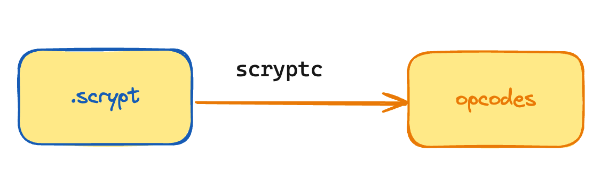
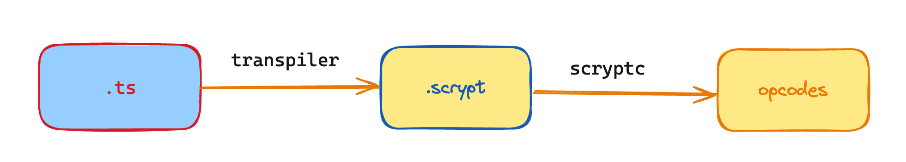
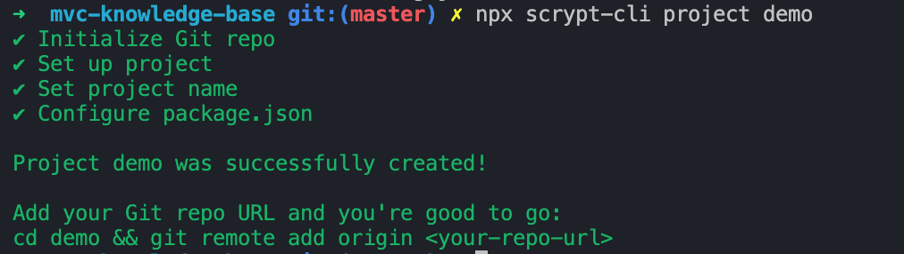
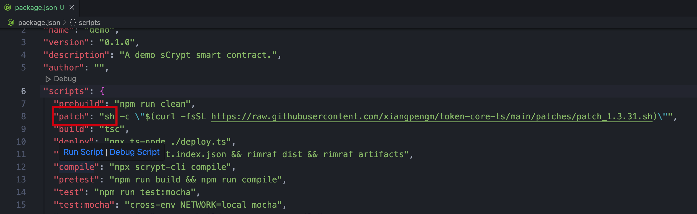
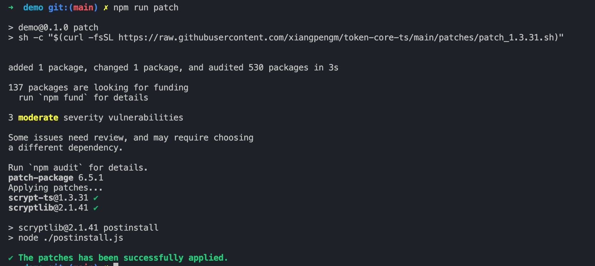
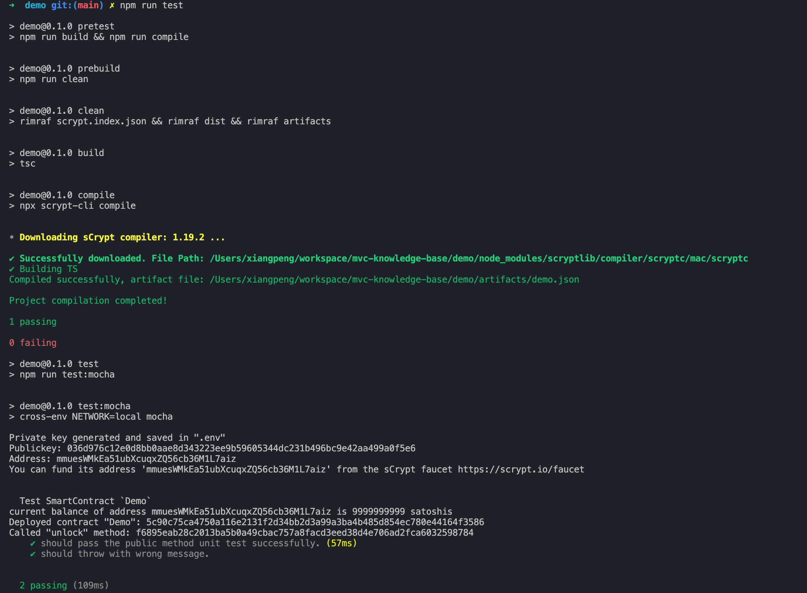

# 准备环境

## [sCrypt](https://scrypt.io/)

MVC 智能合约开发使用 sCrypt 开发套件，sCrypt 开发语言分成两个大版本。

### [scrypt classic](https://scrypt-ide.readthedocs.io/en/latest/getting_started.html)
使用scrypt classic编写智能合约，合约源文件以.scrypt结尾，使用 scryptc 编译为 [bvm 字节码](https://en.bitcoin.it/wiki/Script#Constants)，scryptlib实例化合约、构造交易、测试合约、部署上链。目前官方已不建议使用。


### [scrypt](https://docs.scrypt.io/)
使用 TypeScript 来编写智能合约，合约源文件以.ts结尾，具体流程为scrypt-ts-transpiler 转义 .ts 为.scrypt， scryptc 编译为 bvm 字节码，最后用scrypt-ts 实例化合约、构造交易、测试合约、部署上链。

- 对 bvm 运行时变量进行 log
- 只需编写TypeScript，方便前后端集成
- 打包为npm package，方便复用合约，分发合约



### mvc合约

mvc合约在设计开发之初scrypt还没完善，因此采用了scrypt classic，下面是几个合约的开发类型及项目地址。 
| 合约  |  开发类型 |
|---|---|
| [token-core](https://github.com/mvc-labs/token-core)  |  scrypt classic |
| [nft-core](https://github.com/mvc-labs/nft-core)  |  scrypt classic |
| [mvcdao-core](https://github.com/mvc-labs/mvcdao-core)  |  scrypt classic |
| [token-core-ts](https://github.com/xiangpengm/token-core-ts)  | scrypt classic + scrypt |

token-core-ts是对mvc原token、nft合约翻译为scrypt，但是测试用例沿用了scrypt classic，因此开发类型为两种混用。由于scrypt-ts库主要面向BSV不能直接在MVC链使用，因此token-core-ts使用 [patch-package](https://github.com/ds300/patch-package)的方式适配MVC，具体使用方式下文详述。


## 第一个MVC sCrypt合约工程

### [使用scrypt-cli创建项目](https://docs.scrypt.io/installation)

```bash
npx scrypt-cli project demo
cd demo && npm i
```


### 添加patch指令

添加patch指令进入package.json

```
"patch": "sh -c \"$(curl -fsSL https://raw.githubusercontent.com/xiangpengm/token-core-ts/main/patches/patch_1.3.31.sh)\""
```


### 执行patch

```bash
npm run patch
```



### 执行scrypt-ts本地测试

```
npm run test
```
